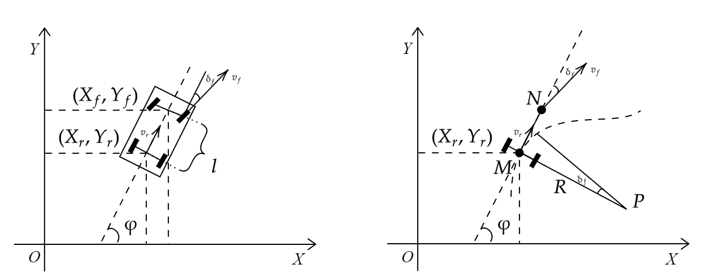
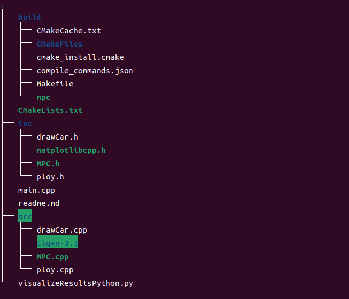
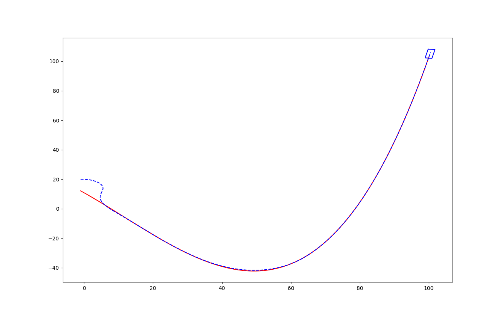
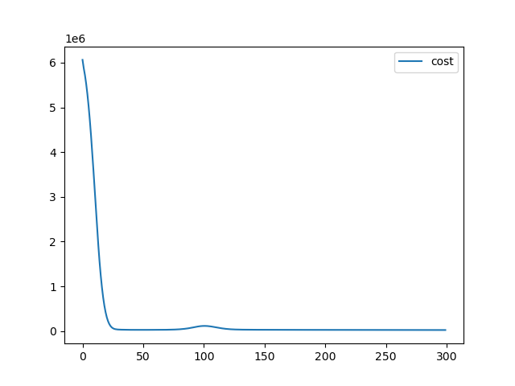
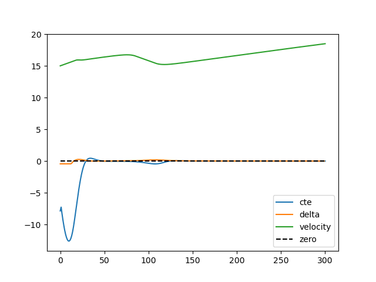

# 前言

经过上次[MPCLearn](https://cn.overleaf.com/project/667111b9640abc2d8b517bdd)文档之后，对MPC确实有了一定的了解，但是只是非常浅的一部分，导师给出了很多改进的建议、方向，在此感谢导师能在百忙之中指导。之后依据导师给出的建议在互联网上搜寻了各种相关资料和教程，例如：MPC的C++实现、使用[IPopt](https://coin-or.github.io/Ipopt/)求解库、自动微分([cppAD](https://www.coin-or.org/CppAD/Doc/ipopt_solve_get_started.cpp.htm))、[Linux开发](https://www.bilibili.com/video/BV1fy4y1b7TC/?share_source=copy_web&vd_source=9ae9c88ec0cd688ee796da26703c7502)等等。对于C++从某种程度上来说是C的超集，通过这段时间的查看和修改别人的MPC源码逐渐适应了C++的一些新特性，例如：命名空间、类、类型模板、函数重载、运算符重载、引用等等。经过不断的实操也逐渐适应了一些Linux命令以及CMake的用法，这些将为后续的学习打好坚实的基础。最终在不断的梳理现有代码以及不断的修改试验添加的新内容努力下完成了myMPC_v1的项目，不过在这期间碰到了不少的坑，遂萌生了写一篇总结报告记录下来，也好重新梳理一遍查漏补缺。

# 预备技能

## Linux和CMake

其实在最早有参照一篇无约束的MPC的C++实现的[博客](https://blog.csdn.net/u011341856/article/details/122799600)，这篇文章给出的代码其实就是[DR_CAN](https://www.bilibili.com/video/BV11B4y1X78N/?share_source=copy_web&vd_source=9ae9c88ec0cd688ee796da26703c7502)那个MATLAB代码的C++版本，把代码克隆到本地后发现她用了CMake，起初也是跟着readme.md文档进行操作跑通一遍代码，但是这个代码例子确实过于简单，后面在github上（又或者说全网都在用的一个开源MPC项目）找到以自动驾驶为例的[轨迹跟踪MPC控制的C++实现](https://github.com/NikolasEnt/Model-Predictive-Control.git)，由于当时代码能力有限实现的方式过于复杂（其实也就是那个3D框架没学过，不会）看着头疼，想着简化一下，于是就有了myMPC_v1项目。所以为了能够直接在Linux系统编辑、编译、运行代码就在网上找到了一个既短小精悍又通俗易懂的[Linux环境下基于VSCode和CMake实现C/C++开发教程](https://www.bilibili.com/video/BV1fy4y1b7TC/?share_source=copy_web&vd_source=9ae9c88ec0cd688ee796da26703c7502)。

## cppAD和IPopt安装

这里不得不提一下ipopt安装真是废了好几天时间，之前尝试的命令行安装都无法正常进行，好在皇天不负有心人，在网络冲浪时抓到了"[救命稻草](https://blog.csdn.net/weixin_42277529/article/details/126641660)"，通过文章给出的源码安装方式可以顺利进行，高血压瞬间消失了。

# myMPC_v1项目

## 项目简介

-   实现功能：给定参考轨迹，小车通过MPC算法跟踪轨迹，绘制轨迹跟踪动态图以及状态变量曲线图。

-   参考项目：https://github.com/rising-turtle/SelfDriving.git[]{#reference
    label="reference"}

-   编程语言：C++

## 项目内容

1.  项目依赖安装参照[\[reference\]](#reference){reference-type="ref"
    reference="reference"}(项目简介）

2.  车辆运动学模型（简化版）、目标函数和约束条件

    {#fig:carModule
    width="90%"}

    参考[文章分析](https://blog.csdn.net/qq_42258099/article/details/95353986)，可以得到最终的状态方程（模型状态等式约束方程组）：
    $$\begin{aligned}
                \begin{cases}
                    x_{t+1} &= x_t+v_t*cos(\varphi_t)*dt \\
                    y_{t+1} &= y_t+v_t*sin(\varphi_t)*dt \\
                    \varphi_{t+1} &= \varphi_t+\dfrac{v_t}{L_f}*\delta_t*dt \\
                    v_{t+1}&=v_t+a_t*dt\\
                    cte_{t+1}&=f(x_t) - y_t +v_t*sin(e\varphi_t)*dt\\
                    e\varphi_t+1 &=\varphi_t - \varphi des_t +\dfrac{v_t}{L_f}*\delta_t*dt
                \end{cases}
            
    \end{aligned}$$ 目标函数： $$\begin{split}
                    J &= \sum_{i=0}^{N-1} \left[ 2500(cte_i - ref\_cte)^2 + 2500(\varphi_i - ref\_\varphi)^2 + (v_i - ref\_v)^2 \right]\\
                    &+ \sum_{i=0}^{N-2} \left[ 5(\delta_i)^2 + 100(a_i)^2 + 700(\delta_i \cdot v_i)^2 \right]\\
                    &+ \sum_{i=0}^{N-3} \left[ 200(\delta_{i+1} - \delta_i)^2 + 10(a_{i+1} - a_i)^2 \right]
                    \end{split}$$ 其中的权重系数可以任意修改。\
    物理约束条件： $$\begin{aligned}
                \begin{cases}
                    \varphi \in [-25^\circ,25^\circ]\\
                    a \in [-1,1]
                \end{cases}
            
    \end{aligned}$$

3.  代码分析:

    项目文件如下图所示

    {#fig:myMPC_v1files
    width="50%"}

    图形绘制使用了[matplotlibcpp库](https://matplotlib-cpp.readthedocs.io/en/latest/index.html),这是一个可以用C++调用Python库matplot的头文件库，后续计划采用将数据导出为csv格式然后再用Python绘制图形。参考轨迹采用多项式拟合的方式，本项目的轨迹是由ploy库拟合的一个三次多项式。下面重点分析MPC.cpp文档：

    1.  创建函数对象FG_eval也就是FG_eval类定义了operator()运算符，该运算符接受两个参数：ADvector&fg和const
        ADvector
        &vars，在这个运算符中，对如下形式的目标函数和约束条件进行操作
        $$\begin{aligned}
                \text{minimize} \quad & f(x) \\
                \text{subject to} \quad & gl \leq g(x) \leq gu \\
                                          & xl \leq x \leq xu
                
        \end{aligned}$$
        并存储在fg中。值得一提的是代码中的g(x)是前面提到的等式约束方程组。

    2.  设置约束条件范围

4.  效果演示

    <figure id="fig:myMPC_v1outcome">
    
  

    <figcaption>myMPC_v1代码运行结果</figcaption>
    </figure>

# 最后

本人才疏学浅仅是拼凑myMPC_v1项目就耗费大量时间和精力且深知现在所学还只是皮毛，但并不会就此止步，故本项目只是起点，后续还会继续深入研究，敬请期待！
